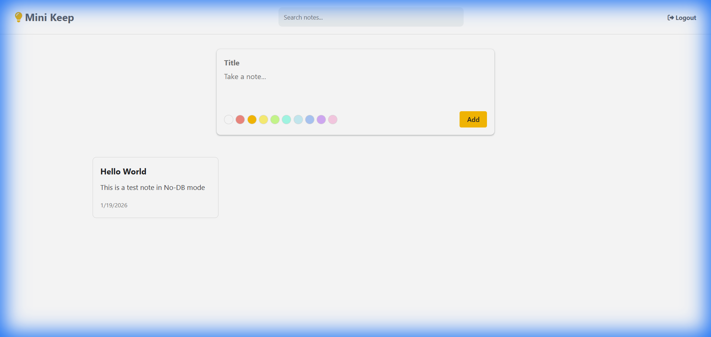
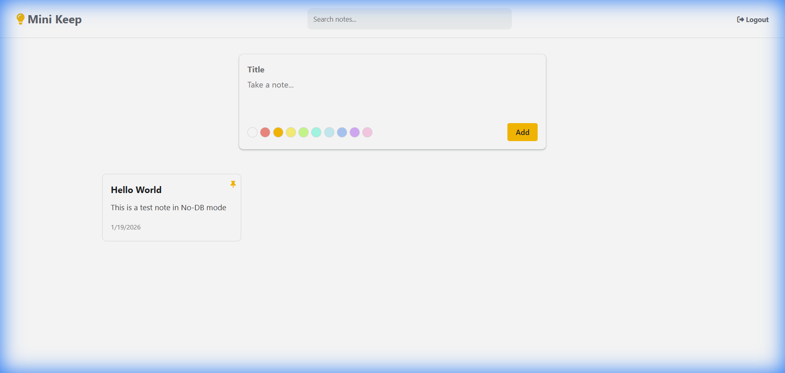

# Mini Keep Clone 📝

A full-stack note-taking application inspired by Google Keep. Built with **Node.js**, **Express**, **MongoDB** (with In-Memory Fallback), and **Vanilla JavaScript**.

## 🎨 Project Preview

### Dashboard with Notes


### Pinned Notes & Persistence


---

## 🚀 Features
- **Create Notes**: Add title, description, and choose a color.
- **Pin Notes**: Keep important notes at the top.
- **Edit & Delete**: Manage your notes easily.
- **Search**: Filter notes by content.
- **Authentication**: Secure Login and Registration system using JWT.
- **No-DB Mode**: Automatically runs in-memory if MongoDB is not installed/running.

## 🛠 Tech Stack
- **Frontend**: HTML5, CSS3, JavaScript (ES6+)
- **Backend**: Node.js, Express.js
- **Database**: MongoDB (Mongoose)
- **Auth**: JSON Web Tokens (JWT) & Bcrypt

## 📦 How to Run

1. **Clone the repository**
   ```bash
   git clone https://github.com/Manojs018/mini-keep.git
   cd mini-keep
   ```

2. **Install Dependencies**
   ```bash
   cd backend
   npm install
   ```

3. **Start the Server**
   ```bash
   npm start
   ```
   The backend server will start on `http://localhost:5000`.
   *Note: If you don't have MongoDB running, it will start in "No-DB Mode" (data saved in memory).*

4. **Open the App**
   Open your browser and visit `http://localhost:5000`.

## 📂 Project Structure
```
mini-keep/
├── backend/        # Node.js Server & API
│   ├── config/     # DB Connection
│   ├── controllers/# Business Logic
│   ├── models/     # Database Schemas
│   ├── routes/     # API Endpoints
│   └── server.js   # Entry Point
└── frontend/       # Client-side Code
    ├── css/        # Styles
    ├── js/         # Logic
    └── pages/      # HTML Pages
```
